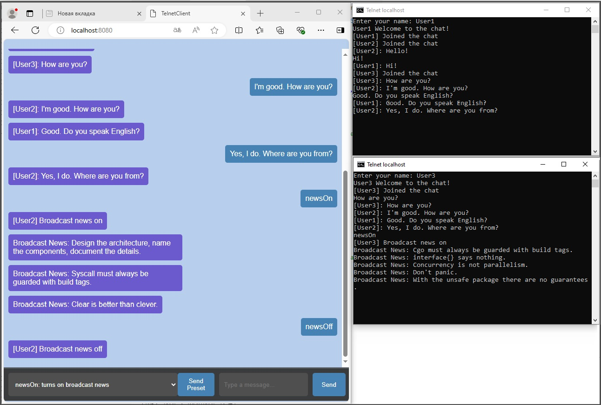

# TelnetServerClient + Go

<div align="center">
	
</div>

## Требования к системе:

Разработайте сетевую службу по аналогии с сервером времени (не RPC), которая бы каждому подключившемуся клиенту показывала раз в 3 секунды случайную Go-поговорку. Поговорки возьмите с сайта https://go-proverbs.github.io/.
Служба должна поддерживать множественные одновременные подключения. Служба не должна завершать соединение с клиентом.
Вы должны проверить работу приложения с помощью telnet.

## Описание работы приложения:

Согласно заданию разработана сетевая служба, которая каждому подключившемуся клиенту отправляет случайную Go-поговорку. Служба поддерживает множественные одновременные подключения. Служба не завершает соединение с клиентом после отправки сообщения. Работа приложения проверена с помощью telnet и клиентского приложения.
Реализованы серверная и клиентская части. 

Написан простой чат обмена сообщениями между подключенными клиентами, с рассылкой широковещательных сообщений от сервера всем клиентам, у которых есть подписка на рассылку новостей, ввиде поговорок. Реализован простой набор команд для работы чата. Для подключения к чату можно использовать стандартный telnet клиент или клиент написанный на go c web интерфейсом.


**Описание серверной части:**<br>
***cmd\server\server.go***<br>

- Сервер ожидает подключения клиетов;
- Поддерживает ряд команд для организации работы чата;
- Осуществляет рассылку широковещательных сообщений(поговорки go) всем клиентам, у которых есть подписка на рассылку;

**1) Пакет "chatserver" отвечает за работу сервера, поддерживает ряд команд по работе с клиентами**<br>
***pkg\chatserver\chatserver.go***<br>
***pkg\chatserver\chatserver_test.go***<br>

Список поддерживаемых команд:
1) help - выводит подсказку ввиде пунктов меню
2) close - клиент выходит из чата
3) list - показать список всех подключенных клиентов
4) name<-content - отправить сообщение конкретному клиенту
5) newsOn - подписаться на рассылку новостей
6) newsOff - отписаться от рассылки новостей

**2) Пакет "proverbs" считывает список поговорок с сайта https://go-proverbs.github.io/**<br>
***pkg\proverbs\proverbs.go***<br>
***pkg\proverbs\proverbs_test.go***<br>

Если доступа к сайту нет, поговорки беруться из локального ресурса

**Описание клиентской части:**<br>
При подключению к серверу, необходимо указать свое имя, которое будет видно всем участникам чата.
Далее клиент может отправлять сообщения всем участникам чата или конкретному участнику, получать рассылку новостей или отказаться от неё.
Для получения всей необходимой информации и списка доступных команд необходимо ввести help.

В качестве клиентского приложения может использоваться стандартный telnet клиент или клиент написанный на go c web интерфейсом.

**Клиент написанный на go c web интерфейсом:**<br>
***cmd\client\client.go***<br>

**1) Пакет "chatclient" отвечает за работу клиента, как участника чата**<br>
***pkg\chatclient\chatclient.go***<br>
***pkg\chatclient\chatclient_test.go***<br>

**2) Пакет "api" предоставляет web интерфейс работы клиента**<br>
***pkg\api\api.go***<br>
Для приема сообщений от сервера используется WebSocket("ws://host:port/ws"):<br>
	api.router.HandleFunc("/ws", api.wsHandler)

Для передачи данных используется метод протокола HTTP: 
- POST для передачи сообщений серверу <br>
	api.router.HandleFunc("/sendDataTo", api.sendDataToHandler).Methods(http.MethodPost, http.MethodOptions)<br>

**3) Для визуализации и организации REST API схемы запросов используется HTML+Javascript:**<br>
***cmd\client\ui\html\base.html***<br>
***cmd\client\ui\html\routes.html***<br>
 

## Revision
 
- 1: packages: chatserver, proverbs, chatclient, api 


## Usage:

**1.Enter this command to start the server program:**

**go run server.go -host "localhost:12345"**

1) host: connect ip:port.

**go run server.go**

defualt value (-host "localhost:12345")

**2.Enter this command to start the client program:**

**go run client.go -host "localhost:12345"**

1) host: connect ip:port.

**go run client.go**

defualt value (-host "localhost:12345")

**Open the web browser and go to for client:**

```sh

http://127.0.0.1:8080/ or  localhost:8080

```

## Authors:

@PolinaSvet

**!!! It is for test now !!!**